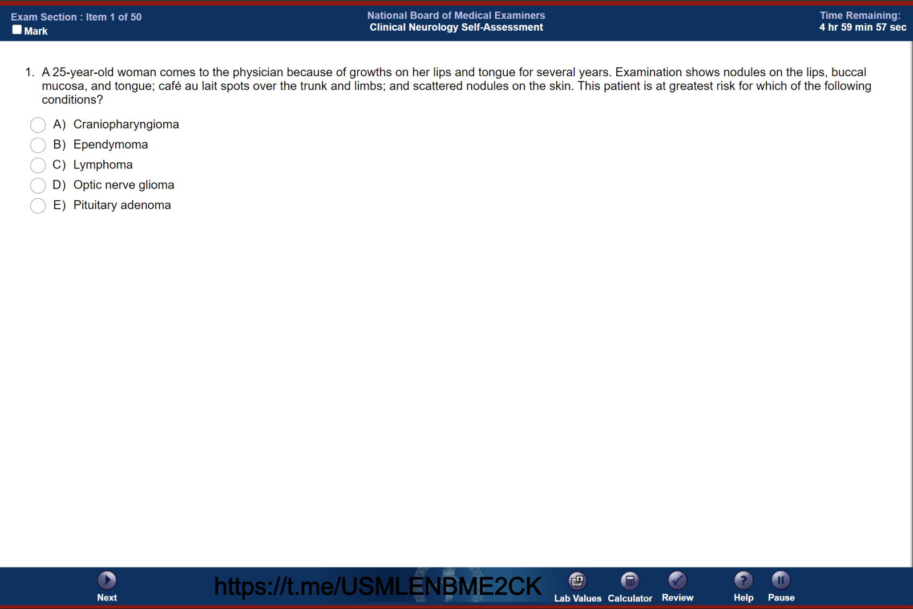

# NBME Self-Assessment Simulator

This application is a desktop-based interactive simulator designed to mimic the National Board of Medical Examiners (NBME) test-taking interface. It allows users to load a PDF of practice questions, tracks time, and provides standard NBME tools like highlighting, answer strike-outs, and a question review screen.

Created by Kaitlin Harold, VP&S c/o 2028, with the help of Google Gemini

For suggestions on how to improve, feel free to GroupMe message or email me at kaitlinharold@gmail.com

## 🛠️ Prerequisites & Installation

This application requires **Python 3.x**. To run the code, you will need to install a few third-party Python libraries that handle PDF extraction and image rendering.

Open your terminal or command prompt and run the following command:

```bash
pip install PyMuPDF Pillow PyPDF2

```

* **PyMuPDF (`fitz`):** Used to render high-quality images of the PDF pages for the visual preview.
* **Pillow (`PIL`):** Used to handle and resize the image previews inside the Tkinter application.
* **PyPDF2:** Used as a fallback and text-extraction utility.

### Additional Setup

Before running the script, open the Python file and update the `LAB_VALUES_PDF_PATH` variable (near the top of the file) to point to the local file path of your lab values PDF.

```python
LAB_VALUES_PDF_PATH = "path/to/your/lab_values_reference.pdf" 

```

---

## 📖 How to Use the Interface

### 1. Loading an Exam

* Launch the application by running the Python script.
* Click the **"Load PDF"** button in the bottom left corner.
* Select your PDF file. The parser specifically looks for questions formatted with a number followed by a period (e.g., `1.`) and ending with a question mark (`?`), with answer options formatted with capital letters and a parenthesis (e.g., `A)`).
    * For best results, the PDF should be screenshots of the NBME exam (like those provided in the shared drive). For example:

* Once loaded, the timer will automatically start (calculated at 90 seconds per question).


### 2. Taking the Test

* **Answering:** Standard click on the radio buttons to select an answer.
* **Process of Elimination (Strike-out):** Hold `Alt` (Windows) or `Option` (Mac) and click on an answer text to cross it out. Click again with the modifier key to remove the strike-out.
* **Highlighting:** Click and drag your mouse over any text in the question box to highlight it in yellow. To remove a highlight, simply click anywhere on the existing yellow highlighted text.
* **Marking:** Check the **"Mark"** box in the top-left corner to flag a question for later review.
* **Viewing Images:** If the PDF page contains an image (or is a screenshot), a thumbnail preview will appear on the right side of the screen. Click the thumbnail to open a scaled, full-size view of the image. Click the full-size image to close it.

### 3. Navigation & Tools

* **Next / Previous:** Use these buttons to navigate chronologically through the block.
* **Pause:** Halts the timer and brings up a full-screen block to hide the exam content while you step away.
* **Lab Values:** Attempts to open the local PDF specified in your configuration using your computer's default PDF viewer.
* **Review:** Opens a grid interface showing all questions in the block.
* 🟢 **Green:** Answered
* 🔴 **Red:** Unanswered
* 🚩 **Flag:** Marked for review
* Clicking any button in the review grid will immediately jump you to that question.


### 4. Review Mode

If the timer reaches `0 hr 00 min 00 sec`, or if you manually choose to end the block after the last question, the application enters **Review Mode**.

* The header will turn yellow to indicate you are in Review Mode.
* The timer will stop.
* All answer choices, highlighters, and checkboxes will be locked to prevent further changes while you review your work.